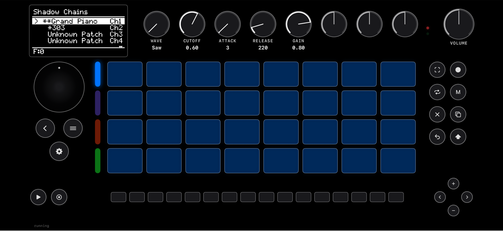

# iSchwung

> **⚠️ Disclaimer — please read.** This was **vibe coded** — built fast and
> exploratory, *not* cleaned up for an official release. Expect rough edges,
> hardcoded assumptions, and barely any tests. **Do whatever you please with it**
> — no warranties, no support implied.
>
> **All the real work belongs to others.** iSchwung is just an Apple-platform
> port of **[Schwung](https://github.com/charlesvestal/schwung)** by
> [Charles Vestal](https://github.com/charlesvestal). Schwung in turn builds on
> the **[Move Anything](https://github.com/bobbydigitales/move-anything)** project
> by [@bobbydigitales](https://github.com/bobbydigitales) — with @talktogreg,
> @impbox, @deets, and especially @bobbyd — which figured out how to talk to the
> Move's hardware in the first place. Huge credit and thanks to all of them; this
> repo merely wires their work onto macOS / iOS.

A port of [Schwung](https://github.com/charlesvestal/schwung)'s on-screen **Shadow
UI** to Apple platforms (macOS / iOS / iPadOS), running Schwung's four chain-slot
audio pipeline **standalone** — no Ableton Move hardware required. The Move's
control surface is recreated in SwiftUI; the audio is a thin native CoreAudio /
RemoteIO backend. Upstream Schwung is kept **byte-for-byte unmodified** — every
Apple-specific change lives in `native/` and `iSchwung/`.



---

## Status

### Working
- **macOS and iOS Simulator** — full Shadow UI, standalone audio (4 chain slots +
  master FX), a transport clock that drives sequencer MIDI-FX, live knob mapping /
  labels, a GPU (Metal) intensity graph, and a multitouch surface.
- **Physical iPhone** — builds and runs (audio + UI) once you set your **own**
  signing team; see [Physical iPhone](#physical-iphone).
- **Sound generators** — built-in `simple-synth`, plus native ports: `sf2`,
  `dexed`, `obxd`, `braids`, `plaits`, `303`, `nusaw`, `chiptune`.
- **Audio FX** — `freeverb`, `mverb`, `midiverb`, `psxverb`, `gate`, `ducker`,
  `junologue-chorus`, `tapedelay`, `filter`, `usefulity`, `ambiotica`.
- **MIDI FX / sequencers** — `euclidrum`, `eucalypso`, `genera`, `superarp`,
  `chord`, `arp`, `velocity_scale`.
- **Tools** — `davebox` (8-track sequencer). See the standalone caveats below.
- **JS-only catalog modules** via `native/fetch-modules.sh`.

### Not done / limitations
- **Most Module-Store modules still need native DSP ports** — the catalog's
  prebuilt `.so` are ARM-Linux and won't load; each needs a per-module macOS/iOS
  recompile (`native/port-*.sh`). Per-module status, effort, and impact are
  tracked in [`native/PORTING.md`](native/PORTING.md) (23 / 79 done). JS-only
  modules work as-is.
- **davebox standalone caveats** — it builds and loads, but a few features assume
  real Move hardware: its tracks 1–4 route to *native Move tracks* (absent here,
  so only its tracks 5–8 → Schwung chains produce sound), pad aftertouch isn't
  surfaced by the SwiftUI surface, and Ableton-export shells out via a subprocess
  that's unavailable on iOS.
- **LFO modulation** — `master_fx:lfoN` config is stored but not yet applied.
- **Link Audio / jack / sampler / skipback** — not ported; these requests answer
  "absent."
- **No Move hardware integration** — standalone only; pad routing is approximated
  (the Move firmware normally owns it).
- **Transport** is a fixed 120 BPM internal clock (the standalone build has no
  external clock source).

---

## How it works

Schwung's Shadow UI was already a **separate process**: ~18k lines of QuickJS
JavaScript talking to the audio side only through shared-memory structs and a
small plugin API — no direct hardware access. iSchwung keeps that UI intact and
replaces only the Move-firmware shim:

- **`native/build-core.sh`** builds `libschwungcore.a` — QuickJS plus Schwung's
  unmodified `shadow_ui.c` / `js_display.c` / … — with `apple_compat_overrides.h`
  force-included (`-include`) to macro-remap filesystem calls and translate the
  Move's hardcoded `/data/UserData` into a per-user data root.
- **`native/apple_audio_engine.c`** reimplements the audio shim over CoreAudio
  (macOS) / RemoteIO (iOS), `dlopen`-ing Schwung's `chain_host.c` as four eager
  chain instances and servicing the param / MIDI shared-memory protocol.
- **`iSchwung/`** is the SwiftUI app: it draws the Move surface and bridges to the
  engine through `native/include/schwung_apple.h`.

Depth: [`docs/feasibility.md`](docs/feasibility.md) (the original feasibility
study) and [`native/README.md`](native/README.md) (the compat layer in detail).

---

## Prerequisites

- macOS with **full Xcode** (not just the Command Line Tools — `xcrun`'s SDK
  lookup fails otherwise):
  `sudo xcode-select -s /Applications/Xcode.app/Contents/Developer`
- `python3` (Pillow is auto-installed into a venv for font generation)
- `git`

## Quick start

```sh
git clone https://github.com/hashFactory/iSchwung && cd iSchwung
./setup.sh                 # clones upstream Schwung, builds the native core, preps the sim
open iSchwung.xcodeproj
```

Pick **My Mac** or an **iOS Simulator** destination and Run.

`setup.sh` clones upstream Schwung into `git-schwung/` (pinned to a known-good
commit, gitignored), builds the native core + module DSP + fonts for macOS and
the simulator, and prepares the simulator data root. Pass `--macos-only` to skip
the simulator build.

> **Important:** the native core must be built **before** Xcode can link the app.
> If you open the project and Run without `setup.sh` (or `build-core.sh`) first,
> you'll get a "library not found for `-lschwungcore`" linker error.

## Manual build

If you'd rather not use `setup.sh`:

```sh
# 1. Upstream Schwung must live at ./git-schwung
git clone https://github.com/charlesvestal/schwung git-schwung

# 2. Build the native core (macOS)
export DEVELOPER_DIR=/Applications/Xcode.app/Contents/Developer
cd native && ./build-core.sh
```

Then Run on **My Mac** — the app prepares its own data root on first launch.

**iOS Simulator** needs two extra steps (the simulator reads the data root from
the repo directly):

```sh
cd native
TARGET=iossim ./build-core.sh
TARGET=iossim ./sync-runtime.sh "$PWD/build/ios-data"
```

### Physical iPhone

1. In Xcode → the `iSchwung` target → **Signing & Capabilities**, set your own
   **Team** (it's intentionally blank in the repo).
2. Build the device runtime tree and signed module dylibs:
   ```sh
   cd native
   TARGET=ios ./build-core.sh
   TARGET=ios ./sync-runtime.sh "$PWD/build/ios-runtime"
   ```
   The **Embed Schwung Runtime** build phase bundles and re-signs them.
3. Run on the device and trust the developer profile.

## Optional: more sound modules

```sh
cd native
./fetch-modules.sh         # stage JS-only catalog modules
./port-sf2.sh              # a native port (also: port-dexed/obxd/braids/plaits/303,
                           #   the FX ports filter/usefulity/ducker/…, and port-davebox)
TARGET=iossim ./port-sf2.sh   # simulator slice of the same
```

After staging extra modules, re-run `sync-runtime.sh` (per target) so they land in
the simulator/device data root — `setup.sh` only stages the built-in set.

---

## Repo layout

| Path | What |
|------|------|
| `iSchwung/` | SwiftUI app — Move surface, engine bridge, Metal graph, touch overlay |
| `native/` | Apple compat layer, CoreAudio engine, build & per-module port scripts ([details](native/README.md)) |
| `docs/feasibility.md` | Original feasibility study |
| `git-schwung/` | Upstream Schwung checkout — **gitignored**, fetched by `setup.sh` |
| `setup.sh` | One-shot bootstrap |

## The Schwung dependency

iSchwung builds its UI and DSP straight from upstream Schwung, kept unmodified.
`setup.sh` pins a known-good commit (`SCHWUNG_PIN`); bump it after re-verifying
against a newer Schwung. Because the port leans on Schwung's internal
shared-memory contract and file layout, tracking `main` blindly can break the
build — hence the pin.

## License

Not yet chosen. Note that upstream Schwung and the ported modules (Plaits,
Open303, Dexed, OB-Xd, …) each carry their own licenses; sort these out before
any redistribution of build artifacts.
